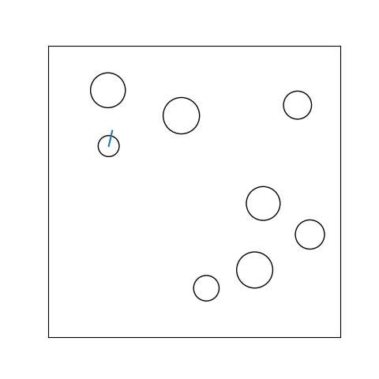
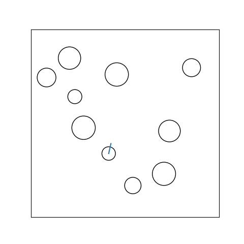
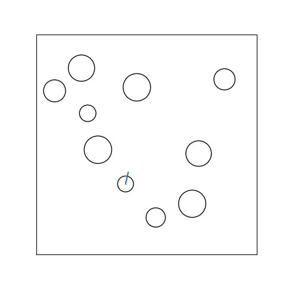

# RL Robot Navigation with LiDAR

This project studies **single-robot autonomous navigation** in a continuous 2D environment using **LiDAR-based perception**.
A mobile robot must reach a target while avoiding obstacles under partial observability.

We train a reinforcement learning policy using **Proximal Policy Optimization (PPO)** and compare it against a
**rule-based reactive baseline** under varying obstacle density.
Experimental results show that PPO achieves over **90% success rate** on simple maps and maintains
**86%+ success rate** in cluttered environments, while the rule-based baseline fails to generalize as complexity increases.

Beyond qualitative visualization, we conduct a **reward ablation study** to analyze how reward design
affects navigation performance, safety, and efficiency.

---

## Overview

Autonomous navigation is a fundamental problem in robotics, requiring agents to make **long-horizon decisions**
from incomplete sensory information.

In this project, we study single-robot navigation in a continuous 2D world using **LiDAR-based observations**.
The robot receives distance measurements from a fixed number of LiDAR rays and controls its linear and angular velocity
to reach a goal while avoiding collisions with walls and circular obstacles.

We compare:
- a **learning-based policy** trained with PPO, and
- a **hand-crafted rule-based baseline** based on goal-seeking and obstacle braking,

to highlight the advantages of reinforcement learning over reactive heuristics.

---

## Environment & Setup

### Environment

- 2D bounded square world  
- Circular robot with unicycle dynamics  
- Circular obstacles with random positions and sizes  
- Goal location sampled at a sufficient distance from the robot  

Two map configurations are used:
- **Easy**: sparse obstacles (`n_obs = 8`)
- **Hard**: dense obstacles (`n_obs = 12`)

### Observation Space

Each observation consists of:
- LiDAR distances (16 rays, normalized)
- Goal position in the robot’s local frame
- Heading error to the goal (sin, cos)
- Previous control inputs (linear and angular velocity)

### Action Space

- Continuous action: **[v, ω]**
- Linear velocity: v ∈ [0, v_max]
- Angular velocity: ω ∈ [-ω_max, ω_max]

### Reward Function

The reward is designed to encourage efficient and safe navigation:
- Positive reward for reducing distance to the goal
- Large positive reward for reaching the goal
- Large negative penalty for collisions
- Small time penalty to discourage stalling
- Small angular velocity penalty to reduce excessive spinning

---

## Training

- **Algorithm**: Proximal Policy Optimization (PPO)  
- **Library**: Stable-Baselines3  
- **Training steps**: 250k timesteps  
- **Evaluation**: deterministic policy  

---

## Results

### Qualitative Comparison (Visualization)

**Easy Map (n_obs = 8)**  
PPO learns smooth, goal-directed navigation and proactively avoids obstacles.
In contrast, the rule-based baseline frequently stalls due to conservative braking behavior.

- **PPO**  
  

- **Rule-based Baseline**  
  

**Hard Map (n_obs = 12)**  
As obstacle density increases, PPO remains robust and continues to reach the goal reliably.
The rule-based baseline, however, almost always fails to make progress in cluttered regions.

- **PPO**  
  

- **Rule-based Baseline**  
  

---

### Quantitative Evaluation

Each policy is evaluated over **200 episodes** with fixed random seeds.

| Map             | Policy              | Success Rate | Collision Rate | Avg Steps |
|-----------------|---------------------|-------------:|---------------:|----------:|
| Easy (n_obs=8)  | PPO                 | **90.0%**    | 0.0%           | 61.9     |
| Easy (n_obs=8)  | Rule-based Baseline | 0.5%         | 0.0%           | 248.8    |
| Hard (n_obs=12) | PPO                 | **86.5%**    | 1.5%           | 65.9     |
| Hard (n_obs=12) | Rule-based Baseline | 0.0%         | 0.0%           | 250.0    |

---

### Reward Ablation Study

To analyze how reward design affects navigation behavior,
we conduct a reward ablation study by selectively removing or weakening
individual reward components.

Each policy is evaluated over **200 episodes** with fixed random seeds.

| Map             | Reward Setting | Success Rate | Collision Rate | Avg Steps |
|-----------------|---------------|-------------:|---------------:|----------:|
| Easy (n_obs=8)  | full          | 89.5%        | 0.0%           | 62.1     |
| Hard (n_obs=12) | full          | 84.0%        | 0.5%           | 71.9     |
| Easy (n_obs=8)  | no_progress   | 95.5%        | 0.5%           | 51.1     |
| Hard (n_obs=12) | no_progress   | 91.5%        | 3.5%           | 51.7     |
| Easy (n_obs=8)  | weak_collision| 93.5%        | 4.0%           | 43.9     |
| Hard (n_obs=12) | weak_collision| 90.5%        | 7.5%           | 43.1     |
| Easy (n_obs=8)  | no_time       | 91.0%        | 0.5%           | 58.8     |
| Hard (n_obs=12) | no_time       | 90.5%        | 2.5%           | 54.4     |

**Key observations:**
- Removing progress-based rewards increases success rate but results in more aggressive behavior and higher collision rates.
- Weak collision penalties reduce episode length but significantly compromise safety, especially in cluttered environments.
- Time penalties help prevent stalling and encourage consistent forward motion.
- The full reward formulation provides the best balance between success, safety, and efficiency.

---

## Discussion

The results demonstrate that **learning-based navigation significantly outperforms
hand-crafted heuristics**, particularly in environments requiring long-horizon planning.

While aggressive reward settings can improve success rate or efficiency,
they often lead to unsafe behaviors.
Balanced reward design is therefore crucial for reliable autonomous navigation.

---

## Future Work

Possible extensions include:
- Trajectory visualization for deeper behavioral analysis
- Curriculum learning with progressively increasing obstacle density
- Multi-robot navigation and collision avoidance
- Generalization to unseen map layouts
- Integration with ROS or real-world simulators for sim-to-real transfer

---

## Acknowledgements

This project uses Stable-Baselines3 and Gymnasium.
